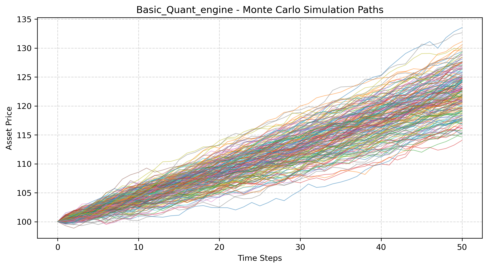

# Basic_Quant_engine

High-performance C++ (OpenMP) multi-asset quantitative engine featuring Monte Carlo pricing for Black-Scholes, Heston, and Merton models, support for various payoff types, model calibration via Nelder-Mead, calculation of Greeks and robust portfolio risk calculation.

---

##  Features

- **Stochastic Models**: 
  - Black-Scholes Model
  - Heston Stochastic Volatility Model
  - Merton Jump-Diffusion Model
  - Multi-asset correlation handling using Crout matrix decomposition.
- **Model Calibration & Optimization**:
  - Nelder-Mead simplex solver for parameter calibration against market data.
- **Monte Carlo Pricing Engine**:
  - European options 
  - Path-dependent options (Asian, Barrier options, etc.)
  - American options via Longstaff-Schwartz least-squares regression.
- **Portfolio & Risk Management**:
  - Heterogeneous asset/payoff portfolio management using `std::variant` and `std::visit`.
  - Risk metrics calculation including Value at Risk (VaR) and Expected Shortfall (CVaR).
- **Performance**:
  - Parallelized simulations using OpenMP (`omp.h`).
---
- **Data Visualization**:

##  Project Structure

```text
Basic_Quant_engine/
├── include/            # Core headers (Models, Payoffs, Portfolio, Risk, Solvers, etc.)
├── test/               # GoogleTest unit test files
├── main.cpp            # Demo executable entry point
├── CMakeLists.txt      # CMake build configuration
└── README.md
'''

